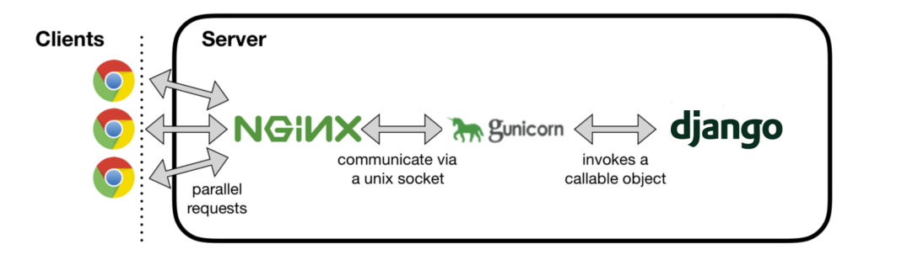
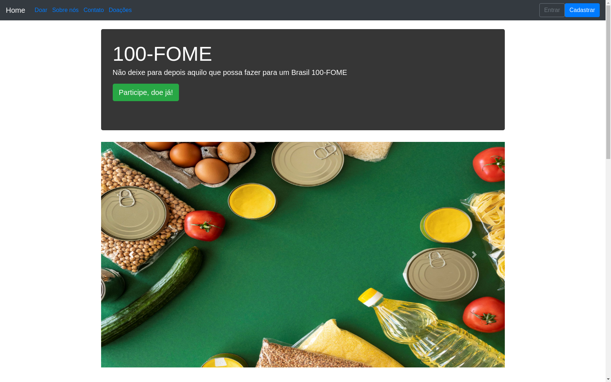

# Projeto Integrador I - Univesp - 2021
## Requisistos
O Projeto Integrador I tem como objetivo o desenvolvimento de um software com framework web 
que utilize noções de banco de dados, praticando controle de versão.

## Tema poposto
Tecnologia da informação como uma ferramenta de impacto social na redução da
fome e insegurança alimentar.

## Título
Portal 100-FOME

## Descrição 
O objetivo desse projeto foi integrar
tecnologia da informação, utilizando-a como uma ferramenta de impacto social na redução da
fome e insegurança alimentar, pela criação de um portal de doações de alimentos através de um
software com framework web. O Design Thinking foi adotado como processo de progressão de
todo o projeto, em que o desenvolvimento Web foi construído com a linguagem de programação
Python juntamente com o framework Django, resultando num website com controle de usuários,
banco de dados e navegação simples para organizar e facilitar a interação entre doadores e
instituições de caridade.

## Tecnologias utilizadas
### Arquitetura
```
MTV - Model Template View
```

### Desenvolvimento
```
Python
Framework Django
Banco de dados SQlite
Bootstrap

```
### Servers 
```
Gurnicorn server
NGINX Server
```

## Implantação
### Modelo 
<h3 align="center">
  
</h3>

### IaaS utilizada
```
Amazon AWS Lightsail
```

### VPS 
```
Ubuntu 18.04 LTS
1 vCPU 1GB
40 GB SSD
```

## Projeto 
<h3 align="center">
  
</h3>

## License
[MIT](https://choosealicense.com/licenses/mit/)
